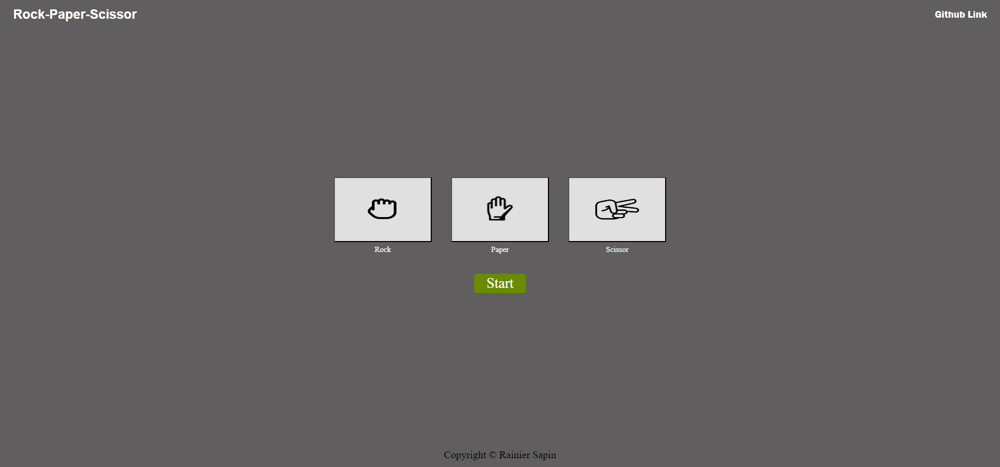

# Rock-Paper-Scissors

Welcome to the Rock-Paper-Scissors game against the computer! This is a classic game where you, the player, compete against the computer by choosing between three options: rock, paper, and scissors. The winner is determined by the well-known rules: rock beats scissors, scissors beat paper, and paper beats rock.

